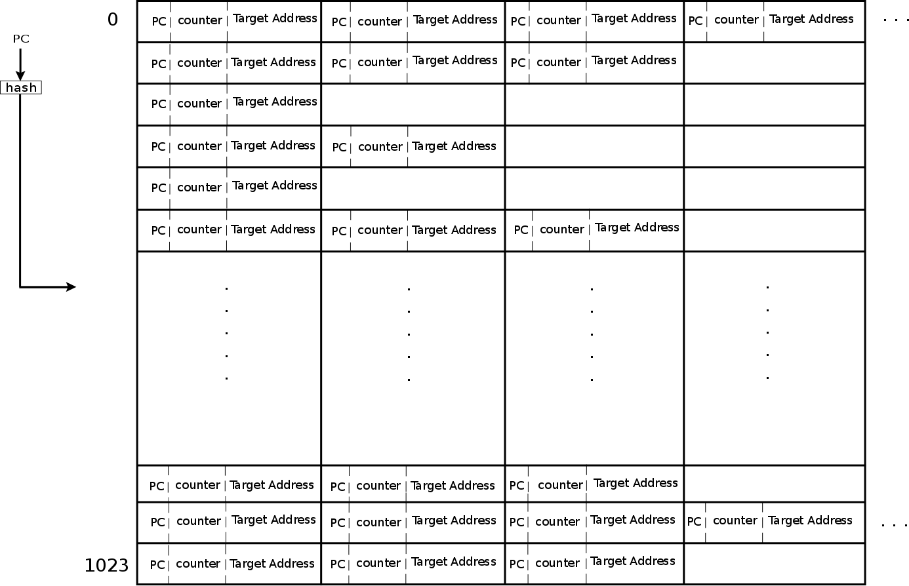
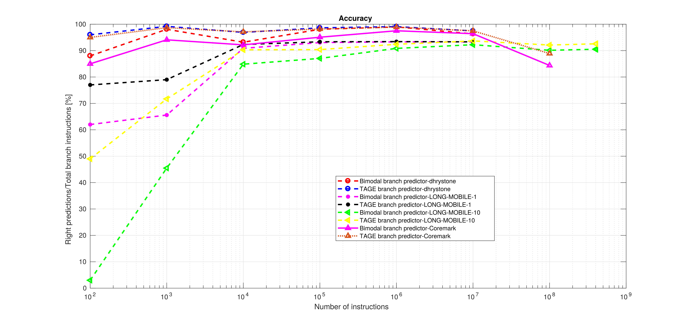
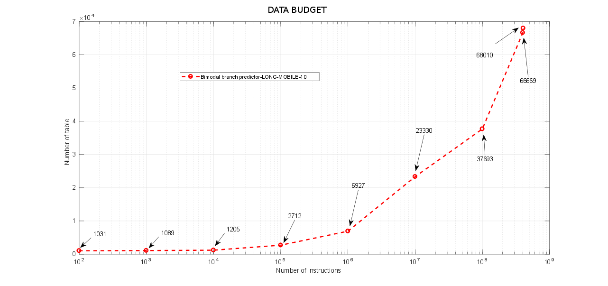
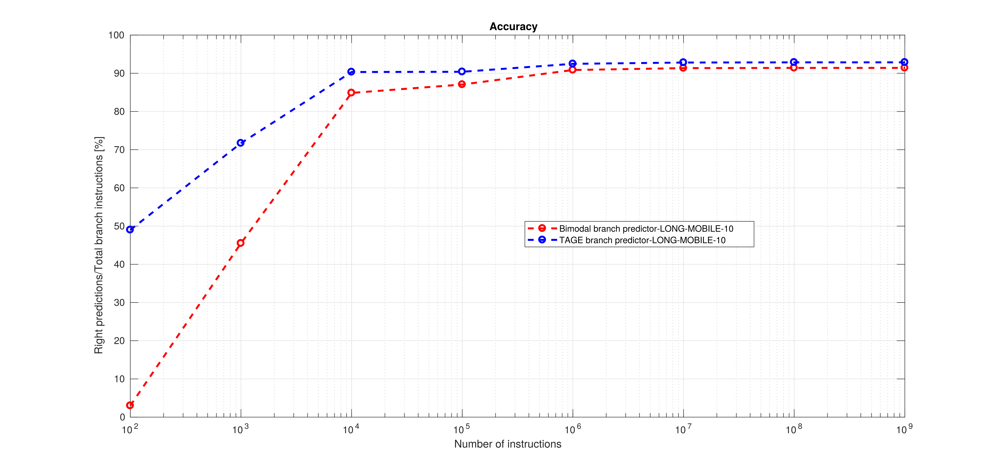
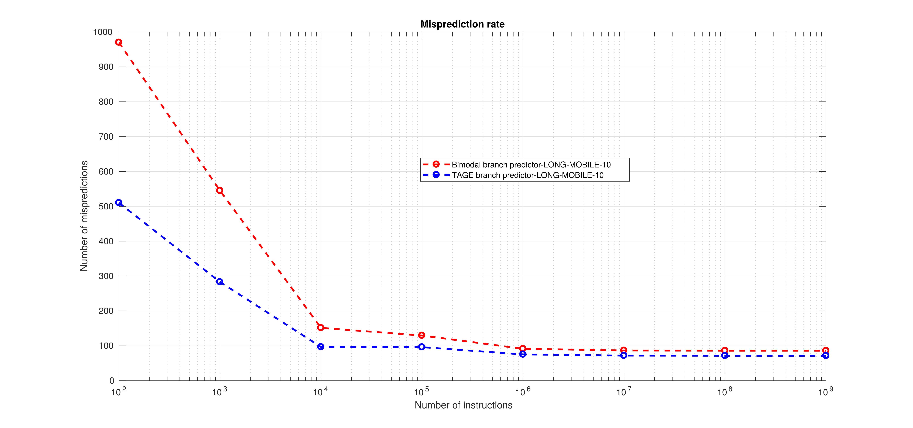

# SEMESTER PROJECT
## Branch prediction - what's left
## Authors:
* Fabio CARACCI
* Marco COLETTA
* Francesco CONDEMI

## Supervisor:
* Professor Renaud PACALET

---
# Table of contents:
* [Project description](#Project_description)
* [Preliminary studies](#Phase_1)
	* [Bimodal Branch Predictor](#Bimodal)
	* [Tage Branch Predictor](#Tage)
* [Qemu settings and modifications](#Phase_2)
* [Qemu helper function](#Phase_3)
* [BP implementations](#Phase_4)
	* [Bimodal implementation](#bimodal_impl)
	* [L-TAGE implementation](#tage_impl)
* [Client-server (QEMU-BP) exchanging data by shared memory](#SHM)
	* [Why shared memory technique](#SHM_why)
	* [Named semaphores](#SHM_semaphores)
	* [SHM partitioning](#SHM_partitioning)
	* [SHM organisation](#SHM_organisation)
	* [How to use it](#SHM_how)
	* [Bugs and improvements](#SHM_bug)
		* [Last instructions](#SHM_bug_instr)
		* [Semaphores](#SHM_bug_sem)
	* [Useful links](#SHM_link)
* [Data gathering](#Phase_4_data_gathering)
	* [How to set the connection up](#How_to_set_the_connection_up)
	1. [About Dhrystone](#About_Dhrystone)
		* [How to run Dhrystone](#How_to_run_Dhrystone)
	1. [About Coremark](#about_Coremark)
		* [How to run Coremark](#run_Coremark)
	1. [CBP-5 Traces](#CBP-5)
* [Data processing](#Data processing)
* [Results and Conclusions](#Results and Conclusions)
* [Further remarks](#Further remarks)

-----

# Project description <a name="Project_description"></a>
The goal of the project is to analyze already existing Branch Predictors (BP) and
evaluate performances of some implementations in order to exploit new possible improvements.  
In particular, using an high level CPU model like QEMU to emulate an AARCH64
architecture, different benchmark such as Dhrystone and Coremark have been run.  
After having properly instructed QEMU, in which a Linux kernel has been installed,
Program Counter, target address and actual decision on branches have been extracted.  
After this first part of configuration, two models have been considered and implemented  
using C language.  
The fist one is a modification of the simple bimodal predictor while the second is a version  
of a state of art implementation of TAGE predictor.  
Using these two models of BP, instructions extracted from QEMU, have been used to retrieve statistics
on performances.  
To get more exhaustive results, data from Championship Branch Prediction (CBP-5) have been also used.

---------------

# Preliminary studies <a name="Phase_1"></a>
Before starting coding and implementing, the first thing we have done was investigating and studying branch predictors from the simplest one to the state of art.  
In particular, we focused on the bimodal branch predictor and on the TAGE predictor, understanding the strategy it is based on and its improvements.

-----

## Bimodal Branch Predictor <a name="Bimodal"></a>
This implementation is based on Dynamic prediction, that consist in exploiting run time behaviours of branches in oder to make more accurate predictions w.r.t. the static ones.
In others words, the prediction can change depending on the execution of the program.  

It is based on a 2 bit counter and a finite state machine with four states corresponding to the output of the counter on which the prediction outcome will be based on:
- 00 Strongly not taken
- 01 Weakly not taken
- 10 Weakly taken
- 11 Strongly taken

When a branch is evaluated, the state in the FSM is updated. Not taken branches will decrease the counter towards zero (Strongly not taken) and the taken ones will increment the counter towards 3 (Strongly taken).  

The FSM is represented in the following figure:


-----

## Tage Branch Predictor <a name="Tage"></a>
Also this implementation ins based on Dynamic prediction. The TAgged GEometric length predictor relies on several predictor tables indexed by function of the global  branch history and the branch address. It also uses geometric history length because this allows to exploit correlation between recent branch outcomes and old ones.
The figure below shows one realisation of this predictor.


T0 is a base predictor (can be a bimodal predictor) in charge of providing a simple prediction, instead the other components consist of a signed counter _ctr_ whose sign provides the prediction , a _tag_ and useful counter _u_.

In the general case, the overall prediction is provided by the hitting tagged predictor component that uses the longest history and its _ctr_ is update; in case no matching occurs, the T0 prediction is used.
The _provider component_ is the matching component with longest history, whereas the _altpred_ is the prediction that would have occurred if there had been a miss on the provider component.

The useful counter _u_ of the provider component is updated when the alternate prediction _altpred_ is different from the final prediction _pred_.

On misprediction one entry is allocated. If the provider component Ti is not the one with the longest history, we allocate an entry on the predictor component Tk with *i < k <= M* , being M the index of the component with logest history length.

An allocated entry is initialized with the prediction counter _ctr_ set to weak correct and the useful counter _u_ is set to 0, that is not very useful.


------------
# Qemu settings and modifications <a name="Phase_2"></a>
  [1]: http://www.qemu.org/
  [2]: images/Qemu-logo.png (hover text)

In this phase, since we need an high-level model of an AARCH64 architecture where running our benchmark and we need to retrieve branch addresses for statistics, we have used [](http://www.qemu.org/).  
Qemu stands for Quick Emulator and it is an hosted hypervisor that performs hardware virtualization. (It is open-source)  
In order to run our benchmark on a specified architecture, we have used a linux kernel[](https://www.kernel.org/), and busybox [](https://busybox.net/)  that provides several stripped-down unix tools in a single executable file.  
Since the final architecture is an ARM one, we have cross-compiled the linux kernel and busybox with Linaro Linux Targeted Binary Toolchain [](https://www.linaro.org/). The cross-compiler is needed since the produced executable code (that will run into qemu) targets an architecture that is different from the one where the toolchain is running.  
The root working directory at the end should have this structure:  

../my_working_directory/  
	├── qemu/  
	├── busybox/  
	├── linux/  
	├── server_and_predictors/  
	├── busybox.cpio.gz  
	├── Makefile  
	└── tftp_script  

To reproduce this, first step to follow is to clone this repository:    
open a new terminal and run the following command  
```
git clone git@gitlab.eurecom.fr:coletta/Branch_prediction_whats_left.git
```
After having cloned the whole repository enter in the folder:
```
cd Branch_prediction_whats_left/
```
This folder have the following structure:

../Branch_prediction_whats_left    
├── images  
│   ├──...  
├── other_files  
│   ├── aarch64baremetal  
│   ├── AArch64-Reference-Manual.pdf  
│   ├── AndreSeznec_CBP4_Unlimited  
│   ├── AndreSeznec.ppt  
│   ├── CbpOrgChairPresentation.pptx  
│   ├── client-server_SHM  
│   └── client-server_socket  
├── README.md  
└── src_and_configurations  
&nbsp;&nbsp;&nbsp;&nbsp;&nbsp;├── BP_read_from_file  
&nbsp;&nbsp;&nbsp;&nbsp;&nbsp;├── busybox_tftp_config  
&nbsp;&nbsp;&nbsp;&nbsp;&nbsp;├── Coremark  
&nbsp;&nbsp;&nbsp;&nbsp;&nbsp;├── Dhrystone  
&nbsp;&nbsp;&nbsp;&nbsp;&nbsp;├── linaro_packages  
&nbsp;&nbsp;&nbsp;&nbsp;&nbsp;├── Makefile  
&nbsp;&nbsp;&nbsp;&nbsp;&nbsp;├── network_QEMU_script  
&nbsp;&nbsp;&nbsp;&nbsp;&nbsp;├── src_for_shm_tage  
&nbsp;&nbsp;&nbsp;&nbsp;&nbsp;└── src_qemu_tofile   

Src_and_configurations folder contains Qemu source files that can replace original Qemu source files to output statistics on a file or the shared memory version. Benchmark's source files can be also found together with some useful script files on this folder.  
To reproduce my_working_directory:  
```
mkdir my_working_directory
```
Then copy inside this new directory the main Makefile that will help you to build the entire "infrastructure". (modify properly /some/path/ with the target path on your case)  
```
cp /some/path/Branch_prediction_whats_left/src_and_configurations/makefile /some/path/my_working_directory
```
Enter in my_working_directory:
```
cd /some/path/my_working_directory
```
Now, download linux kernel in a directory in my_working_directory called /linux from their websites. (HINT: clicking on TUX, the Linux penguin in the description above, you will be redirected on the official website)  
To continue building the infrastructure:
```
make qclone
```
That will clone the latest version stable-2.8 of QEMU on the qemu folder. Successively it is necessary to run the following commands:
```
make qconfigure
make qbuild
```
These two previous commands should be run every time qemu source files are modified as when we want to gather information to be used for our tests on branch predictors.  
It is now necessary to clone, configure and install busybox by running:
```
make initrd
```
After having correctly installed busybox, Linux kernel must be downloaded, as explained at the beginning, and located in a subfolder called /linux otherwise the following command will not work:
```
make kconf
make kmenuconf
make kbuild
```
The last command will configure and cross-compile the linux kernel that will run in Qemu.  
Now, in oder to create a suitable network with the emulated system you can use this script: [other_files/network_QEMU_script].  
N.B.
* this `network_QEMU_script` file must be in the root directory in which there are all the other directories with QEMU, Busybox, Makefile, ...  
* change user value with yours and nic with the name of your Ethernet interface  
* Run it every time you reboot your PC using the command:

	```bash
	chmod a+x network_QEMU_script
	sudo ./network_QEMU_script
	```

Once you have done all these steps, to run Qemu simply type on the terminal:

```
make run
```
If thing went wrong you should see:

```bash
script /tmp/run -c '\
	stty intr ^] && \
	...
	-monitor telnet:192.168.0.1:2222,server,nowait,nodelay \
	'
Script started, file is /tmp/run
[    0.000000] Booting Linux on physical CPU 0x0
...
[   11.740591] Freeing unused kernel memory: 1088K

Please press Enter to activate this console.
/ #
```
To turn off QEMU simply write on the Qemu terminal:

```
poweroff
```
-----
# Qemu helper function <a name="Phase_3"></a>
An helper function of TCG has the aim of wrapping up a user function to be called in the same way it is done for Qemu library functions. This is done to ensure that user functions are compliant with coding rules imposed by the TCG of QEMU.  
In our case we have used helper functions to instrument Qemu to extract, for a given branch instruction, its program counter, the target address associated to that branch and the final decision taken (taken / not taken)  
To create an helper function three files must be changed: helper-a64.h, helper-a64.c and translation-a64 located in /qemu/src/target-arm:
* Macro in helper-a64.h: DEF_HELPER_3(printer, dh_retvar_decl0_void, i64, i64, i64).  
* Definition of the helper function in helper-a64.c:
void HELPER(printer)(uint64_t pc, uint64_t addr, uint64_t T_NT).
* Call it in the translation-a64 file: gen_helper_printer(tcg_pc1,tcg_addr1,tcg_t_nt1).  

To use it in the translation, TCGv_i64 type must be used as well as
the tcg_const_i64 function to save values that vary from instruction to instruction at the time.   
The position where to put these instruction is foundamental: them must be created, translated and destroyed before the gen_goto_tb instruction. The reason is that QEMU is a dynamic recompiler and generates recompiled code that potentially runs multiple times. The generated code contains a jump at the point of the gen_goto_tb so when the generated code from the compilation is running, you never execute the code below.    
(Source:  [A Novel Technique for Making QEMU an
Instruction Set Simulator for Co-simulation with
SystemC](http://www.iaeng.org/publication/IMECS2011/IMECS2011_pp249-254.pdf))    
We have used such helper function in every block that translates a branch instruction.    
The implemented helper function can be used just copying the three source files from the /src_qemu_tofile directory to the original source files of Qemu and recompile it as previously explained.  

-----
# BP implementations <a name="Phase_4"></a>
## Bimodal implementation <a name="bimodal_impl"></a>
The starting point has been the simplest and well known bimodal, but instead of using just one counter for all PC we associated one counter to each of them such that the performances are considerably improved.  
The bimodal table is a kind of matrix: it has 1024 fixed rows and has an infinite number of columns in the sense that for each entry that was not already present in the table, a new entry will be allocated in the relative row.  
The *Hash function* will decide the row where the BP will check if the current Branch was already encountered or where possibly allocate a new entry.
This hash function can be chosen pretty arbitrarily using i least significant bits of the branch address (current PC). The goal is to distribute the mappings as equally and efficiently over the whole table, avoiding overlapping as much as possible.  
This simple bimodal of unlimited size is however able to reach good performances.


-----

## L-TAGE implementation <a name="tage_impl"></a>
For this BP our implementation followed exactly what is written in the section [Tage Branch Predictor](#Tage) and moreover we took as reference the Seznec L-TAGE proposed for the CBP that is also discussed in this paper: [L-TAGE](http://www.irisa.fr/caps/people/seznec/L-TAGE.pdf).  
You can find every explanation of the code we implemented directly in the comments of the C files.

------
# Client-server (QEMU-BP) exchanging data by shared memory <a name="SHM"></a>
In order to gather data from branches encountered in the QEMU AArch64 emulation, a shared memory (SHM) technique was implemented to exchange data between the running software on QEMU (e.g. Dhrystone) and our Branch Predictor on the fly (avoiding to store a huge file).  
Basically, we set our Helper function to write in the SHM the actual program counter, target address and branch taken/not_taken. When a portion of the SHM is full, the Server process resumes and analyses the data stored calling the relatives functions of the implemented TAGE predictor.
All the information about this technique and how to use the program can be found in the following sections, while all the last working files that you can use are saved in the directory [last_src_files/].

## Why shared memory technique <a name="SHM_why"></a>
Running a benchmark application produces a lot of jumps and branches in the instructions, so storing current PC, TargetAddress and type of branches information in a file to be analysed later will result in a slow process and will fill the hard disk. For that reason, the best option is to let our branch predictor analyse on the fly those data and store only the useful results. That is what the files in [last_src_files/] do.  
To exchange lots of data between applications on the fly, the best optimised way is to use shared memory (SHM), since reduce the number of writings and readings from the volatile memory without accessing the HD. The files regarding only the SHM management can be found in [other_files/client-server_SHM/].  
Also a TCP socket could have been exploited with the advantage to let different machines work concurrently or from different places. However, by applying this technique, for some implementation, we noticed that after 30 - 60 seconds the running apps where stopped probably by the OS because of the huge data exchange (maybe some firewall configurations were needed) and moreover some data were lost. However if you want to have a look at this trials of implementation, you find 3 different implementations in the directory [other_files/client-server_socket/].

## Named semaphores <a name="SHM_semaphores"></a>
Since in this case the pids of both apps are not known, to synchronise the two processes named semaphores were chosen. Those semaphores will store the flags in named files in temporary system sub-directories. For that reason, if the server or the client do not destroy the semaphores before the end, the previous name for those semaphores have to be changed in order to run again the apps (it is also indicated in the files). In our case the end of the branch instructions is not detected from the client and so we will use those semaphores, thus no one can destroy them, so the name must be changed every time we run those programs.  

## SHM partitioning <a name="SHM_partitioning"></a>
For optimisation reason the shared memory is subdivided in two pieces such that the client can fill one while the server can read the other previously written by the client.  
The status flag of the SHM (completely full, half full ...) is stored in the `status` variable of `shMemory` structure and to read it the `statusMutex_sem` semaphore is used for synchronisation between client and server (only one at time should read or modify this variable).  
When the client has filled the first section of the SHM, he will inform the server `sem_post(clientWrote_sem)` that was waiting on that semaphore `sem_wait(clientWrote_sem)`, so the client starts storing data in the second section while the server begins its computations with the data already stored in the first section. If, for example, the client fills the memory faster than the server reads and uses them, the client will wait that at least one section is free `sem_wait(serverRead_sem)`.  

## SHM organisation <a name="SHM_organisation"></a>
As can be seen from *server.c* the shared data are stored in structures such that any modification for future purposes will be easy to manage.  
In fact only the `struct shm_cell_type`, that is renamed `shmCell`, need to be modified depending on the data you want to exchange. Thus, each partition of our SHM is composed by a vector of cells which are composed by that structure.  
Moreover, reading the 15th data in the vector `shm_s0` means reading the 15th data sent by the client, so both data exchange and order are preserved.  

## How to use it <a name="SHM_how"></a>
It is really simple:
1. Modify both the client's (helper-a64.c) and server's `shmStr` structure as you wish. In it there are the data exchanged for each write/read operation.  
	Currently the `shmCell` is defined as following:

	```c
	typedef struct shm_cell_type{
		uint64_t pc;//program cnt
		uint64_t tAddr;//target address
		uint64_t t_nt;//taken - not taken
	}shmCell;
	```

2. If needed, modify the semaphores' names (read [Named semaphores](#SHM_semaphores) section) and the SHM partitions' length changing the define `NDATA` value.
3. Modify the server code to do the job you want; put your own code in the indicated point:

	```c
	//.....code below here...................../
				for(i = 0; i < NDATA && iCount < desiredIstr; i++){
					// Performing predicitons
					tmp_tage_pred = get_prediction((shm_sector + i)->pc, &pred_str);
					update_predictor((shm_sector + i)->pc, (shm_sector + i)->t_nt, tmp_tage_pred, (shm_sector + i)->tAddr, &pred_str);
					if(tmp_tage_pred == (shm_sector + i)->t_nt){
						tage_pred += 1;		
					}
					iCount ++;
				}
	//.....code above here.....................*/
	```

	The variable `shm_sector` is a pointer to the first cell of the SHM's partition were the server is working.  
	Between those comments you can simply call a function to your own Branch predictor (or whatever).  
	In this case we initialised our BP at the beginning, here we use and update the predictor and at the end of the previous `while` we extract the useful information to be printed in a file.
4. Compile the code and launch it passing as parameter the number of instructions you want to analyse, for instance:

	```bash
	$ gcc -Wall -o server server.c -lrt -lpthread
	$ ./server 100000
	```
	will compile "server.c" and break the `while` after 100000 instructions have been analysed.

## Bugs and improvements <a name="SHM_bug"></a>
### Last instructions <a name="SHM_bug_instr"></a>
Assuming that we want to analyse all the branches encountered, in this implementation of the SHM a bug is present: the last written data by the client are not read from the server if the memory section is not completely full. It means that if we have SHM sections of 1024 cells and at the end we write only 500 data, the client will not inform the server to read them.  
Solutions can be:  
* using a new flag in the `shMemory` but the client should understand when it has finished (not easy in our case)...
* using SHM sections smaller such that the last lost data are few.
* using sections with only one cell length (no data are lost, but overhead due to synchronisation).  

### Semaphores <a name="SHM_bug_sem"></a>
To solve the semaphores' name problem and so to finalise the server computations detecting the end of the benchmark, different solutions exists:  
* instruct Qemu to receive a sigkill that stops the current processes.
* detect in the helper function some address that corresponds to the lasts branches.
* add a timeout to the server if no more data arrives.
* fork the server to enter manually a terminating character.  

## Useful links <a name="SHM_link"></a>
**For further information on server and client applications, using shared memory and semaphores** those link can be useful:  
https://www.softprayog.in/programming/interprocess-communication-using-posix-shared-memory-in-linux  
http://www.csc.villanova.edu/~mdamian/threads/posixsem.html  

------
# Data gathering <a name="Phase_4_data_gathering"></a>
In order to gather data, different Benchmark applications were run on Qemu.    
To run programs over the emulated system, a connection between the host OS and the emulated one is needed to exchange the executable files because, obviously, they are not already embedded in Busybox.  

## How to set the connection up <a name="How_to_set_the_connection_up"></a>
To exchange data with the emulated system we used a tftp connection.  
To create a tftp server the following packages are required:

```bash
sudo apt-get install xinetd tftpd tftp
sudo apt-get install isc-dhcp-server
sudo apt-get install bridge-utils
```
Now create this file under `/etc/xinetd.d/` called `tftp`, for instance type:

``` bash
sudo vim /etc/xinetd.d/tftp
```
cut the following lines and past them in the created file:

```
service tftp
{
protocol        = udp
port            = 69
socket_type     = dgram
wait            = yes
user            = nobody
server          = /usr/sbin/in.tftpd
server_args     = /tftpboot
disable         = no
}
```
Create the following folder and execute the following commands:

```bash
sudo mkdir /tftpboot
sudo chmod -R 777 /tftpboot
sudo chown -R nobody /tftpboot
```
Now you can restart the service with the following commands:

```bash
sudo /etc/init.d/xinetd stop
sudo /etc/init.d/xinetd start
```
Using this connection between host system and guest system it is possible to transfer cross-compiled benchmark on Qemu and run it.

## About Dhrystone <a name="About_Dhrystone"></a>
Dhrystone is a synthetic computing benchmark program developed in 1984 by Reinhold P. Weicker intended to be representative of system (integer) programming. The Dhrystone grew to become representative of general processor (CPU) performance. With Dhrystone, Weicker gathered meta-data from a broad range of software, including programs written in FORTRAN, PL/1, SAL, ALGOL 68, and Pascal. He then characterised these programs in terms of various common constructs: procedure calls, pointer indirections, assignments, etc. From this he wrote the Dhrystone benchmark to correspond to a representative mix. It is written in C language. [Wikipedia](https://en.wikipedia.org/wiki/Dhrystone).

## How to run Dhrystone <a name="How_to_run_Dhrystone"></a>
Dhrystone is a public software which source files can be downloaded from internet and then compiled.  
Its source files are in [Dhrystone/](Dhrystone/) directory but there are also the Makefile to build them and the already built executable file `cc_dry2`.  
To Run Dhrystone these are the steps:
1. Copy the Dhrystone executable in your /tftpboot/ folder.
1. Run the `tftp_script` if not already done.
1. Run QEMU with:

	```bash
	$ make run
	or
	$ make exec
	```
1. Once Busybox is running interact with it typing those commands:

	```bash
	tftp -gr cc_dry2 192.168.0.1
	chmod a+rwx cc_dry2
	./cc_dry2
	```
	N.B.  
	You have to do this step every time you poweroff the emulated system. Otherwise you should find a way to embed this executable in Busybox.
1. You will be later asked to type the number of runs: 10000000 was the minimum for us.

At the end you will see the results.

## About Coremark <a name="about_Coremark"></a>
CoreMark is a synthetic benchmark that measures the performance of central processing units (CPU) used in embedded systems. It is intended to become an industry standard, replacing the older Dhrystone benchmark. The code is written in C and contains implementations of the following algorithms: list processing (find and sort), matrix manipulation (common matrix operations), state machine (determine if an input stream contains valid numbers), and CRC (cyclic redundancy check).  
It was designed to avoid the issues that have been spotted with Dhrystone such as:
-	Compiler optimizations

	Dhrystone is susceptible to compilers being able to optimize work away. When this
	happens, Dhrystone becomes an unreliable processor benchmark.
	With CoreMark, every operation in the benchmark derives values that are not available at
	compile time. This ensures that while compilers can still make optimisations, they cannot
	pre-compute results to optimise the work away completely.  

-	Library calls

	Dhrystone contains library calls within the timed portion of the benchmark, which can
	account for a significant portion of the benchmark time. This makes it difficult to compare
	results where different libraries have been used.
	CoreMark is designed so that it does not make any library calls during the timed portion
	of the benchmark.  

-	Version control

	Dhrystone has no official source, so several different versions are in use. If the Dhrystone
	version is undisclosed, it is difficult to compare benchmark results.
	CoreMark is available from the CoreMark web site http://www.coremark.org/

## How to run Coremark <a name="run_Coremark"></a>
Instructions to run this benchmark in a linux kernel running on QEMU:

1. Coremark can be downloaded from the official site http://www.eembc.org/coremark/download.php filling the registration form or from other git repository (e.g. git clone [https://github.com/tonyho/CoreMark.git](https://github.com/tonyho/CoreMark.git))

1. Modify the file `core_portme.h` and `core_portme.mak` in the right subdirectory:
	* Since we have Linux in QEMU, we have to modify the Linux subdirectory.
		In particular in the core_portme.h we have to set the name of the compiler we want use:

		```
			 #define COMPILER_VERSION "Please put compiler version here (e.g. gcc 4.1)"
		```
		In our case Linaro toolchain:

		```
			 #define COMPILER_VERSION "/home/francesco/Scrivania/aarch64-unknown-linux-gnueabi/aarch64-unknown-linux-gnueabi/bin/aarch64-linux-gnu-gcc"
		```
	* Another important thing is that  ee_ptr_int needs to be the data type used to hold pointers, otherwise coremark may fail.  
		In our case, Linaro support uint64_t as data type to hold pointers:

		```
		   typedef uint64_t ee_ptr_int;
		```
	* In core_portme.mak we have first at all specify the name of the compiler as done for the core_portme.h
		Use this flag to define compiler to use

		```
		    CC = gcc
		```  
		In our case:

		```
		    CC=/home/francesco/Scrivania/gcc-linaro-6.3.1-2017.02-x86_64_aarch64-linux-gnu/bin/aarch64-linux-gnu-gcc
		```
	* Another thing to do is to statically link the library belong to libc

		```
		    LFLAGS_END += -static -L/home/francesco/Scrivania/gcc-linaro-6.3.1-2017.02-x86_64_aarch64-linux-gnu/aarch64-linux-gnu/libc/lib
		```

1. Compile Coremark
	In your pc in a terminal go to the directory containing Coremark type

	```bash
	make  compile PORT_DIR=linux
	make link PORT_DIR=linux
	```
	the file coremark.exe will be created

1. Run Coremark
	To run coremark you can simply type in the terminal
	```bash
	make PORT_DIR=linux
	```
	or type separately:

	```bash
	./coremark.exe  0x0 0x0 0x66 0 7 1 2000 > ./run1.log
	./coremark.exe  0x3415 0x3415 0x66 0 7 1 2000  > ./run2.log
	./coremark.exe  8 8 8 0 7 1 1200 > ./run3.log
	```
	For more info about results and iteration please read the readme.txt  
	In our case to import the coremark in the qemu enviroment we have to follow these steps:
	- start qemu
	- copy the coremark.exe in the tftpboot
	- send the coremark.exe to qemu : in the qemu console type

		```
		tftp -gr coremark.exe 192.168.0.1
		```
	- make it executable:

		```
		chmod a+rwx coremark.exe
		```
	- run the benchmark:

		```
		./coremark.exe  0x0 0x0 0x66 0 7 1 2000 > ./run1.log
		./coremark.exe  0x3415 0x3415 0x66 0 7 1 2000  > ./run2.log
		./coremark.exe  8 8 8 0 7 1 1200 > ./run3.log  
		```  

# CBP-5 TRACES <a name=" CBP-5 TRACES"></a>
Another way that we have used to retrieve branch information is using the CBP-5 infrastructure and trace files.  
Since the format of files are different we have modified some sources of the Championship Branch Prediction in order to have the same scheme used by our branch predictors.  
These files can be located in the somewhere/Branch_prediction_whats_left/other_files/cbp2016.eval.
The instructions to use the framework can be found on their website: [CBP-5](https://www.jilp.org/cbp2016/).
The main thing that must be done is to download their traces (about 10Gb) and extract them in the somewhere/Branch_prediction_whats_left/other_files/cbp2016.eval/traces folder.  
To run the framework in order to output the file to be used for our branch predictors firslty is necessary to enter in the scripts folder.
```
 somewhere/Branch_prediction_whats_left/other_files/cbp2016.eval/scripts
```
It is possible to run all traces or some of them. In order to select only a subpart of them it is possible to modify the bench_list.pl file specifying the name of the trace to be run:
```
$SUITES{'dati'}    =
'LONG_MOBILE-10';
```
Once specified the name of the preferred trace, to run the environment type:
```
./runall.pl -s ../sim/predictor -w dati -f 1 -d ../results/MYRESULTS
```  
The resulting trace is created in the script folder and it is named tracex.txt


------
# Data processing <a name=" Data processing"></a>
### <a name="How to run branch predictors"></a>How to run branch predictors  

Once gathered files thanks to Qemu, generated text file can be used to feed our branch predictors and measure performances.  
Go into the branch_predictors folder
```
cd yourpath/Branch_prediction_whats_left/src_and_configurations/BP_read_from_fileBranch_Predictors
```
Depending on the BP you want to run chose either:
```
 cd BIMODAL_PREDICTOR
```
or
```
cd TAGE_PREDICTOR
```
Depending on the chosen predictor you need to change few parameters:
```
//#define INPUT_FILE "/path/to/test.txt"
#define INPUT_FILE "/path/to/tracex.txt"
```
firstly uncomment the right test file you want to run:  
test --> QEMU results  
tracex --> CBP-5 results  
This changes must be done to the file:  
  * branch.c in the bimodal  
  * common_var.h in the L_TAGE  

Then make the file by writing  
```
make
```
and then depending on the branch predictor you want
```
./name_file_compiled #of_instruction
```
where as example you can put:
```
./predictor 1000000
```
To run the Tage predictor over 1M istructions.   
Results will be provided on the screen and on a file named results.txt as :
```
./predictor 1000000
```

------
# Results and Conclusions <a name="Results and Conclusions"></a>
We decided to test our implementations of branch predictor with both the two types of data we gather from the championship CBP-5 , called LONG-MOBILE-1 and LONG-MOBILE-10, and with the result taken running Dhrystone and Coremark on Qemu. For all these scenarios we considered different number of instructions and we evaluated the accuracy, that is the hit rate normalized over kiloinstruction and the misprediction rate normalized again over the same amount of instruction. Moreover, for the bimodal-like implementation we plotted the size of the prediction matrix as a function of the number of instructions.
The final result have been plotted using Matlab [](https://www.mathworks.com/product/ltc/matlab.html)  and are shown below.







Considering the accuracy and the miss rate, it can be noticed the the shape of the curve depends on the data we consider. In particular, for the data of the CBP-5, the performance get better as the number of instructions increases till a little variation around 10 milions instructions (see caption Further remarks). Instead, for the information taken from the two benchmarks, we can observe a strange behavior both when a small number of instructions (less than 10k) and when a relative huge ones (over 10 milions) are considered. For the first case, indeed, the curve is not monotonic (increasing for the accuracy and decresing for the misprediction). It can be explained considering that at the beginning the instrunctions that we are gathering are not related to the execution of the benchmarks but to the boot sequence of Qemu.
In the other hands when the number of instructions is more than 10 milion, the performances start to significantly decrease because of the shut down sequence that pollutes the input data of our implementation.  
Looking at the performances, the figure show that in general the L-Tage implementation is more accurate and has a lower misprediction rate. Also in this case, we can notice a slight difference depending on the type of input data. Indeed, for the instructions taken from the CBP-5, for a small number of them, the difference between bimodal-like and the L-Tage is more remarkable but it becomes less significant as the number of considered input increase.
Instead, for the result related to each benchmark, the performances of the two implementations are more similar, probably again for the boot sequence that performs jumps and branchs in a more restricted set of target adresses.  
Another observation that can be done is that the performances of the L-Tage should be much more better w.r.t. the bimodal, but it is not our case because we consider that the bimodal matrix on which is based our implementation can grow indefinitely like shown in the data budjet figure.  
The best results are obtained with the L-Tage implementation using the benchmarks till 10 milions instrucitons with about 97.49% of accuracy and 25.06 of misprediction rate. As the number of instructions become bigger the best results are given by the the L-Tage exploiting the CBP-5 data with about 92.57% of accuracy and 74.29 of misprediction rate.

# Further remarks <a name="Further remarks"></a>
During data processing we noticed a strange behavior in  the results over 10^7 instructions. Accuracy should increase as the number of instruction increase, but over 10mln of instruction, it showed a slight worsening.    
To understand the reason of this behavior we have taken LONG-MOBILE-10 trace and duplicated the first million instructions hundred times. The results can be seen below:





In this case, the accuracy increases till an asymptotic value as the number of instructions increase.  
We think that the reason of the non monotonic behavior after 10mln of instructions showed in the section above  is due to an increased stress of the benchmark that lead to a new context and set of operations with completely different addresses.  
Our opinion can be supported looking at the data budget plot, that shows an exponential shape.  
