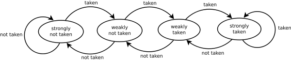

# SEMESTER PROJECT
## Branch prediction - what's left
## Authors:
* Fabio CARACCI
* Marco COLETTA
* Francesco CONDEMI

## Supervisor:
* Professor Renaud PACALET

---

# Project description
The goal of the project is to analyze already existing Branch Predictors (BP) and
evaluate performances of some implementations to exploit new possible improvements.  
In particular, using an high level CPU model like QEMU to emulate an AARCH64
architecture, different benchmark such as Dhrystone and Coremark have been run.  
After having properly instructed QEMU, in which a Linux kernel has been installed,
Program Counter, target address and actual decision on branches have been extracted.  
After this first part of configuration, two models have been considered and implemented  
using C language.  
The fist one is a modification of the simple bimodal predictor while the second is a version  
of a state of art implementation of TAGE predictor.  
Using these two models of BP, instructions extracted from QEMU, have been used to retrieve statistics
on performances.  
To get more exhaustive results, data from Championship Branch Prediction (CBP-5) have been also used.

# Phase 1 Preliminary studies

Before starting coding and implementing, the first thing we have done was to investigate and study branch predictors from the simplest one to the state of art.  
In particular, we focused on the bimodal branch predictor and on the TAGE predictor understanding the strategy it is based on and its improvements.

## Bimodal Branch Predictor

This implementation is based on Dynamic prediction, that is it utilises hardware-based mechanisms that use the run time behaviour of branches to make more accurate prediction w.r.t static ones.
In others words, the prediction can change during the execution of the program.  

It is based on a 2 bit counter and a finite state machine with four states corresponding to the output of the counter and to the outcomes of the prediction:

- 00 Strongly not taken
- 01 Weakly not taken
- 10 Weakly taken
- 11 Strongly taken

When a branch is evaluated, the state in the FSM is update. Not taken branches will decrease the counter till the zero value (Strongly not taken) and the taken ones will increment the counter towards the value 3 (Strongly taken).

The FSM is represented in figure:




## Tage Branch Predictor
Also this implementation ins based on Dynamic prediction. The TAgged GEometric length predictor relies on several predictor tables indexed by function of the global  branch history and the branch address. It also uses geometric history length because this allow to exploit correlation between recent branch outcomes and old ones.
The figure below shows one realisation of this predictor.


T0 is a base predictor (can be a bimodal predictor) in charge of providing a simple prediction, instead the other components consist in a signed counter _ctr_ which sign provides the prediction , a _tag_ and useful counter _u_.

In general case, the overall prediction is provided by the hitting tagged predictor component that uses the longest history and its _ctr_ is update, or in the case of no matching occurs, the T0 prediction is used.
The _provider component_ is the matching component with longest history whereas the _altpred_ is the prediction that would have occurred if there had been a miss on the provider component.

The useful counter _u_ of the provider component is update when the alternate prediction _altpred_ is different from the final prediction _pred_.

On misprediction one entry is allocated. If the provider component Ti is not the one with the longest history we allocate an entry on the predictor component Tk with *i < k <= M* , being M the index of the component with logest history length.

An allocated entry is initialized with the prediction counter _ctr_ set to weak correct and the useful counter _u_ is se to 0, that is strongly not useful.


# Phase 2 Qemu settings and modifications

[![alt text][2 width="200"]][1]

  [1]: http://www.qemu.org/
  [2]: images/Qemu-logo.png (hover text)

In this phase, since we need an high-level model of an AARCH64 architecture on which running our benchmark and retrieve branch addresses for statistics, we have used [](http://www.qemu.org/).  
Qemu stands for Quick Emulator and it is an hosted hypervisor that performs hardware virtualization. (It is open-source)  
In order to run our benchmark on a specified architecture, we have used also a linux kernel[](https://www.kernel.org/), and busybox [](https://busybox.net/)  that provides several stripped-down unix tools in a single executable file.  
Since the final architecture is an ARM one, we have cross-compiled the linux kernel and busybox with Linaro Linux Targeted Binary Toolchain [](https://www.linaro.org/). We needed a cross-compiler since the produced executable code (that will run into qemu) targets an architecture that is different from the one on which the toolchain is running.  
To reproduce all of this first step to follow is to clone this repository:    
open a new terminal and run the following command  
```
git clone git@gitlab.eurecom.fr:coletta/Branch_prediction_whats_left.git
```
After having cloned the whole repository enter in the folder:
```
cd Branch_prediction_whats_left/
```
This folder have the following structure:

../Branch_prediction_whats_left  
├── aarch64baremetal  
├── Branch_Predictors  
├── CoreMark  
├── Dhrystone  
├── dhrystone-2.1  
├── exec  
├── FC  
├── images  
├── Makefile  
├── new_benchmark  
├── README.md  
├── Results  
├── script  
├── src_qemu  
└── src_qemu_puliti  
First of all, if not already done, (if already done a little modification in
the makefile is needed in order to find the source files) it is required to download the linux kernel
from their websites. (HINT: clicking on TUX, the Linux penguin in the description above, you will be redirected on the official website)  
In order to perform what explained at the beginning of this phase,
it is needed to run the makefile following  this order:


# Phase 3 BP implementations


---

# Client-server (QEMU-BP) exchanging data by shared memory
In order to gather data from branches encountered in the QEMU AArch64 emulation, a shared memory (SHM) technique was implemented to exchange data between the running software on QEMU (e.g. Dhrystone) and our Branch Predictor on the fly (avoiding to store a huge file).  
Basically we set our Helper function to write in the SHM the actual program counter, target address and branch taken/not_taken. When a portion of the SHM is full the Server process resumes and analyses the data stored calling the relatives functions of the implemented TAGE predictor.
All the information about this technique and how to use the program can be found in the following sections, while all the last working files that you can use are saved in the directory [last_src_files/].

## Why shared memory (SHM) technique
Running a benchmark application, produces a lot of jumps and branches in the instructions, so storing current PC, TargetAddress and type of branches information in a file to be analysed later will result in slow process and will fill the hard disk. For that reason, the best option is to let our branch predictor analysing on the fly those data and store only the useful results. That is what the files in [last_src_files/] do.  
To exchange lots of data between applications on the fly the best optimised way is to use shared memory (SHM), since reduce the number of writings and readings from the volatile memory without accessing the HD. The files regarding only the SHM management can be found in [other_files/client-server_SHM/].  
Also a TCP socket could have been exploited with the advantage to let different machines working concurrently or from different places, however while applying this technique, for some implementation, we noticed that after 30 - 60 seconds the running apps where stopped probably by the OS because of the huge data exchange (maybe some firewall configurations were needed) and moreover some data were lost. However if you want to have a look at this trials of implementation, you find 3 different implementations in the directory [other_files/client-server_socket/](/other_files/client-server_socket/).

## <a name="Named_semaphores"></a>Named semaphores
Since in this case the pids of both app are not known, to synchronise the two processes, named semaphores were chosen which will store the flags in named files in temporary system sub-directories. For that reason, if the server or the client do not destroy the semaphores before the end, the previous name for those semaphores need to be changed in order to run again the apps (it is also indicated in the files). In our case the end of the branch instructions is not detected from the client and so will use those semaphores, thus no one can destroy them, so the name must be changed every time we run those programs.  

## SHM partitioning
For optimisation reason the shared memory is subdivided in two pieces such that the client can fill one while the server can read the other previously written by the client.  
The status flag of the SHM (completely full, half full ...) is stored in the `status` variable of `shMemory` structure and to read it the `statusMutex_sem` semaphore is used for synchronisation between client and server (only one at time should read or modify this variable).  
When the client has filled the first section of the SHM, he will inform the server `sem_post(clientWrote_sem)` that was waiting on that semaphore `sem_wait(clientWrote_sem)`, so the client starts to store data in the second section while the server begins its computations with the data already stored in the first section. If, for example, the client fills the memory faster than the server reads and uses them, the client will wait that at least one section is free `sem_wait(serverRead_sem)`.  

## SHM organisation
As can be seen from *server.c* the shared data are stored in structures such that any modification for future new purposes will be easy to be managed.  
In fact only the `struct shm_cell_type`, that is renamed `shmCell`, need to be modified depending on the data you want to exchange. Thus each partition of our SHM is composed by a vector of cells which are composed by that structure.  
Moreover, reading the 15th data in the vector `shm_s0` means reading the 15th data sent by the client, so both data exchange and order are preserved.  

## How to use it
It is really simple:
1. Modify both the client's (helper-a64.c) and server's `shmStr` structure as you wish. In it there are the data exchanged for each write/read operation.  
	Currently the `shmCell` is defined as following:
	
	```c
	typedef struct shm_cell_type{
		uint64_t pc;//program cnt
		uint64_t tAddr;//target address
		uint64_t t_nt;//taken - not taken
	}shmCell;
	```
	
2. If needed, modify the semaphores' names (read [Named semaphores](#Named_semaphores) section) and the SHM partitions' length changing the define `NDATA` value.
3. Modify the server code to do the job you want; put your own code in the indicated point:

	```c
	//.....code below here...................../
				for(i = 0; i < NDATA && iCount < desiredIstr; i++){
					// Performing predicitons
					tmp_tage_pred = get_prediction((shm_sector + i)->pc, &pred_str);
					update_predictor((shm_sector + i)->pc, (shm_sector + i)->t_nt, tmp_tage_pred, (shm_sector + i)->tAddr, &pred_str);
					if(tmp_tage_pred == (shm_sector + i)->t_nt){
						tage_pred += 1;		
					}
					iCount ++;
				}
	//.....code above here.....................*/
	```
	
	The variable `shm_sector` is a pointer to the first cell of the SHM's partition were the server is working.  
	Between those comments you can simply call a function to your own Branch predictor (or whatever).  
	In this case we initialised our BP at the beginning, here we use and update the predictor and at the end of the previous `while` we extract the useful information to be printed in a file.
4. Compile the code and launch it passing as parameter the number of instructions you want to analyse, for instance:

	```bash
	$ gcc -Wall -o server server.c -lrt -lpthread
	$ ./server 100000
	```
	will compile "server.c" and break the `while` after 100000 instructions have been analysed.

## Bugs and improvements
### Lasts instructions
Assuming that we want to analyse all the branches encountered, in this implementation of the SHM a bug is present: the last written data by the client are not read from the server if the memory section is not completely full. It means that if we have SHM sections of 1024 cells and at the end we write only 500 data, the client will not inform the server to read them.  
Solutions can be:  
* using a new flag in the `shMemory` but the client should understand when it has finished (not easy in our case)...
* use SHM sections smaller such that the last lost data are few.
* use sections with only one cell length (no data are lost, but overhead due to synchronisation).  

### Semaphores
To solve the semaphores' name problem and so to finalise the server computations detecting the end of the benchmark, different solutions exists:  
* instruct Qemu to receive a sigkill that stops the current processes.
* detect in the helper function some address that corresponds to the lasts branches.
* add a timeout to the server if no more data arrives.
* fork the server to enter manually a terminating character.  

## Useful links
**For further information on server and client applications, using shared memory and semaphores** those link can be useful:  
https://www.softprayog.in/programming/interprocess-communication-using-posix-shared-memory-in-linux  
http://www.csc.villanova.edu/~mdamian/threads/posixsem.html  


------

# Phase 4 data Gathering
# Results
# Conclutions Commenti sui risultati


[last_src_files/]: /last_src_files/
[other_files/client-server_SHM/]: /other_files/client-server_SHM/

------

### IMPORTANT : current qemu version => stable-2.7
* Modified file can be found on src_qemu/
* First branch predictor can be located on src_qemu/Reader_prog
    * Some assumptions :
        * Bimodal
        * No tag only mod(n) for addressing
        * If wrong decision => replace the entry
        * If wrong decision => replace address  

------        
#################################################
########### old sections ########################
------

# THIS IS THE PLACE WHERE TO SHARE INFOS AND TO TAKE IN MIND PROGRESSES

## SEMESTER PROJECT BRANCH PREDICTION WHAT'S LEFT

### First week:

 * About TAGE and its successors:

    * http://www.irisa.fr/caps/people/seznec/JILP-COTTAGE.pdf
    * https://www.irisa.fr/caps/people/seznec/L-TAGE.pdf

 * A study about why TAGE works so well:
    * https://comparch.net/2013/06/30/why-tage-is-the-best/

 * All André Seznec's publications:
    * https://www.irisa.fr/caps/people/seznec/

 * Additional paper:
    * https://sites.ualberta.ca/~delliott/ece510/seminars/2006f/project/Analysis_Of_Branch_Predictors_Ming&Guang/Report/Analysis%20of%20Branch%20Predictors.pdf

### Second week:
  * Start using Qemu:
    * Download and install Qemu
    * Download, install and configure crosstool-NG for x86_64
    * Build and run minimal Linux / Busybox systems in Qemu
      * https://gitlab.eurecom.fr/snippets/23
  * Set all variables and procedures for future use

### Third week:
  * Start using Qemu for bare metal HW
  * Download latest version of Qemu from:
    * http://git.qemu-project.org/?p=qemu.git;a=summary
  * Download, configure and use Crosstool-NG for aarch64-unknown-linux-gnueabi
    * /packages/LabSoC/toolchains
  *Try to run an Hello world bare metal application:
    * Downloaded from:
      * https://github.com/freedomtan/aarch64-bare-metal-qemu
      * Makefile modification to use our toolchain
  * Try to run SPECint2006
  * Try to run Dhrystone
    * Downloaded from:
     * https://fossies.org/linux/privat/old/dhrystone-2.1.tar.gz/
     * Modification to Makefile
     * Find libraries for aarch64
        * Downloaded from: http://www.musl-libc.org/download.html
     * Modification to Makefile for printf
      * Trial : simple hello world try to print

### Fourth week:
  * seful material
    * https://github.com/cloudius-systems/osv/wiki/AArch64
  * Bare-metal dhrystone
    * Makefile modifications
    * Static linking of libc (tried newlib, musl)
    * Linker script
  * Linaro toolchain, QEMU out-of-tree build, Busy-box, Linux kernel
    * Makefile for the entire "framework"
    * Makefile to run Qemu with network to upload files:
        * [Network for Qemu](#NetworkforQemu)

### Fifth week:
  * dnsmasq
  * busybox -> dropbear
  * instrument qemu to get the information that we need
     * helper function to output useful information
        * Jump
            * program counter
            * target address
        * Branch
            * taken/not taken  
            * program counter
            * target address of the branch if taken
            * percentage of taken/not taken
  * Link utili:
       * https://sourcery.mentor.com/GNUToolchain/release2635     (for bare-metal in case of)
       * https://fulcronz27.wordpress.com/2014/06/09/qemu-call-a-custom-function-from-tcg/   (how to create helper functions)
       * http://git.qemu-project.org/?p=qemu.git;a=tree
       * http://git.qemu-project.org/?p=qemu.git;a=blob;f=target-arm/translate-a64.c;h=9f964dfd5de5860e23ba66ba3560b44bf9b67ab1;hb=2ef6175aa76adea2ab8ce1540904a05d6f8e8eed

### Sixth week:
  * Unconditional branch helper function
	* Solved compilation warnings
	* Solved translation issues
        * Improved performances with system call
        * Improved performances with buffered fwrite

### Seventh week:
  * Further material:
    * https://github.com/BLin409/Branch-Prediction-Simulator/blob/master/predictors.cpp
    * https://github.com/sjdesai16/tage

### Eighth week:
  * Branch prediction improvements:
    * Tagging the branch predictor using an hash-table
        * http://www.partow.net/programming/hashfunctions/http://www.partow.net/programming/hashfunctions/
  * Understand the the code in order to find out wether the branch is taken or not
    * http://stackoverflow.com/questions/26748224/how-qemu-knows-the-branch-direction-of-a-tb-which-had-been-executed
        * COMMENTS: Even if we are using wrong prediction (always not taken branches, that's false), changing from mod(n) to hash function we have noticed that a reduction of performances passing
from mod -> 99.150002 hash -> 98.790474.
Even if it could seems worse, it's an improvement since this mean that we are replacing less time the same location in the branch predictor (and so since we are using bimodal BP, we reach the right prediction "always taken" later) because the index brings
to different location. This lead to decrement in a slower way the counter of each taken leading to an higher missprediction rate.


### Ninth week:
  * Found a way to print all the branches (Hope so) code can be found under Files/src_qemu
     * QEMU is a dynamic recompiler. The code runs once, and it generates recompiled code that potentially runs multiple times. The generated code contains a jump at the point of the gen_goto_tb.
  * Start to implement LTage or other BP.
     * Usefull websites:
       * http://home.deib.polimi.it/silvano/FilePDF/ARC-MULTIMEDIA/Lesson_2_Branch_Prediction.pdf
       * https://github.com/ssc3/Perceptron-BranchPredictor
       * https://github.com/sjdesai16/tage
  * Some usefull link for statistics on branch prediction and branch predictor
     * http://bwrcs.eecs.berkeley.edu/Classes/CS252/Projects/Reports/terry_chen.pdf
     * https://www.slideshare.net/rinnocente/computer-architecture-branch-prediction

### Tenth week
  * Our implementation in C of L-Tage
  * Testing of L-tage
  * Debugging of L-tage

### Eleventh week
  * Gathering statistics using Dhrystone (whit qemu) instructions
  * Modified the Championship Branch Prediction (CBP-5) infrastructure to create new files for our c implementations
    *  Gathering statistics using extracted LONG_MOBILE-1 traces of CBP-5
  * Try to compile and use another benchmark for Qemu
  * Try to implement a TCP-IP link between qemu and branch predictors simulators


### <a name="NetworkforQemu"></a>Network for Qemu
To exchange datas with the emulated system we use tftp.To create a tftp server:
Packet required:
```
sudo apt-get install xinetd tftpd tftp
sudo apt-get install isc-dhcp-server
sudo apt-get install bridge-utils
```
Create this file under /etc/xinetd.d/ called tftp (as example with the command)
```
sudo vim /etc/xinetd.d/tftp
```
cutting and pasting the following lines inside
```
service tftp
{
protocol        = udp
port            = 69
socket_type     = dgram
wait            = yes
user            = nobody
server          = /usr/sbin/in.tftpd
server_args     = /tftpboot
disable         = no
}
```
Create the following folder and execute the following commands
```
sudo mkdir /tftpboot
sudo chmod -R 777 /tftpboot
sudo chown -R nobody /tftpboot
```
Now you can restart the service with the following commands:
```
sudo /etc/init.d/xinetd stop
sudo /etc/init.d/xinetd start
```
Now to create a suitable network for the emulator create and run the following script:
(WARNING: change user value with yours in my case was mc and nic with the name of your ethernet interface in my case was enp2s0)
```
user=mc
tap=tap0
bridge=br0
nic=enp2s0

echo "---> Creating taps..."
ip tuntap add dev $tap mode tap user $user
ip link set dev $tap up

echo "---> Creating bridge..."
brctl addbr $bridge
brctl setfd $bridge 0
brctl addif $bridge $nic
brctl addif $bridge $tap

echo "---> Bringing interfaces and bridge up..."
ifconfig $tap 0.0.0.0 promisc up
ifconfig $nic 0.0.0.0 promisc up
ifconfig $bridge 192.168.0.1 netmask 255.255.255.0 up

echo "---> Restart DHCP server"
service isc-dhcp-server restart
```
Now if everything went good run the qemu instance:
(WARNING: this file must be in the root directory in which there are all the other directories with qemu busybox and so on.)
```
ramfs_img		=	$(PWD)/busybox.cpio.gz
kernel_img		=	$(PWD)/linux/arch/arm64/boot/Image
qemu_root = $(PWD)/qemu
qemu_src = $(qemu_root)/src
qemu_build = $(qemu_root)/build
qemu_dtc =  $(qemu_src)/dtc
mon_ip		= 192.168.0.25
tel_ip		= 192.168.0.1
mon_port	= 2222
init_mem	= 1024M

run:
	script /tmp/run -c '\
		stty intr ^] && \
		$(qemu_build)/aarch64-softmmu/qemu-system-aarch64 \
		-M virt \
		-m $(init_mem) \
		-nographic \
		-cpu cortex-a57 \
		-kernel $(kernel_img) \
		-initrd $(ramfs_img) \
		-netdev tap,id=net0,ifname=tap0,script=no,downscript=no \
		-device virtio-net-device,netdev=net0,mac="52:54:00:12:34:50" \
		-append "earlyprintk console=ttyAMA0 loglevel=8 ip=$(mon_ip)" \
		-serial stdio \
		-monitor telnet:$(tel_ip):$(mon_port),server,nowait,nodelay \
		'

# XXX: QEMU monitor - open from a separate terminal
monitor:
	telnet $(tel_ip) $(mon_port)

# XXX: QEMU help
help:
	$(qemu_build)/aarch64-softmmu/qemu-system-aarch64 \
		-M virt \
		-help
```
Now to exchange data with the qemu machine:
To download a file (in QEMU)
```
tftp -g -r <filename> 192.168.0.1
```
To upload a file (from QEMU to Host)
```
tftp -p -r <filename> 192.168.0.1
```
### <a name="How to run branch predictors"></a>How to run branch predictors

Go into the branch_predictors folder
```
cd Branch_Predictors
```
Depending on the BP you want to run chose either:
```
 cd BIMODAL_PREDICTOR
```
or
```
cd TAGE_PREDICTOR
```
Depending on the chosen predictor you need to change few parameters:
```
//#define INPUT_FILE "/path/to/test.txt"
#define INPUT_FILE "/path/to/tracex.txt"
```
firstly uncomment the right test file you want to run:
test --> QEMU results
tracex --> CBP-5 results
This changes must be done to the file:
  * branch.c in the bimodal
  * common_var.h in the L_TAGE

Then make the file by writing
```
make
```
and then depending on the branch predictor you want
```
./name_file_compiled #of_instruction
```
where as example you can put:
```
./predictor 1000000
```
To run the Tage predictor over 1M istructions.
